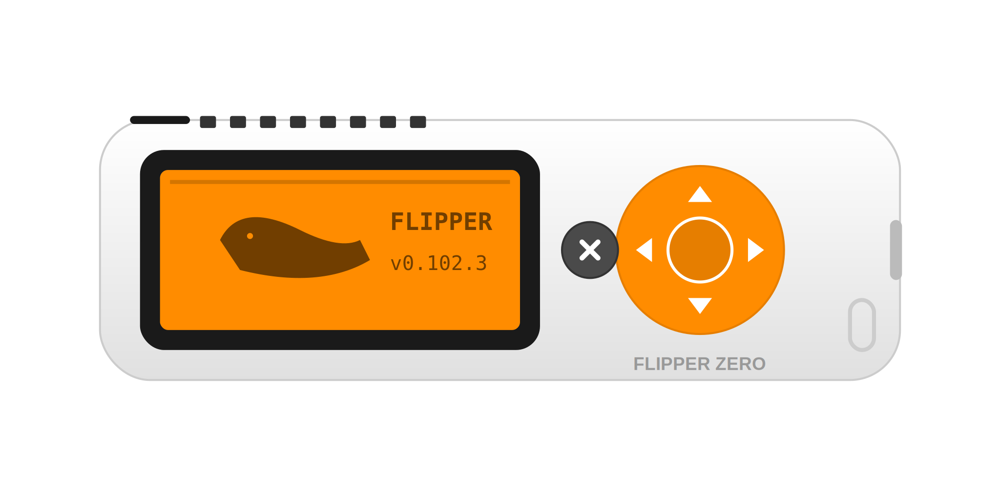

  

---

<h4 align="left">🌟Atualmente, estou cursando Análise e Desenvolvimento de Sistemas Estácio, onde aprofundo meus conhecimentos em áreas como cibersegurança, redes e programação. Além dos estudos acadêmicos, estou constantemente aprimorando minhas habilidades em hacking ético, engenharia reversa e sistemas de segurança. Meu objetivo é me tornar um especialista na área, focando em contribuir para a pesquisa e inovação tecnológica. Busco uma base sólida para alcançar a excelência no meu campo e conquistar independência financeira. 💻🔐💸.
  </h4>

---

## 🤙 A Little About Myself

 

Como estudante de cibersegurança, iniciei meu percurso no mundo da programação aos oito anos de idade. Desde então, dediquei-me ao estudo de diversas linguagens, incluindo HTML, CSS, JavaScript, Powershell, Lua, Assembly x86, Pascal, ShellScript, Python, BatchScript e COBOL. Minha paixão pela cibersegurança e hacking me levou a explorar não apenas a programação, mas também a física teórica. Sou entusiasta de desafios como CTF (Capture The Flag) e mergulho no mundo da fantasia através de RPG de mesa, como o D&D. Além disso, tenho um apreço especial por MUD (Multi-User Dungeon). Atualmente, concentro meus esforços no estudo da engenharia reversa de malwares. Possuo proficiência em C++, Powershell e ShellScript, buscando constantemente aprimorar minhas habilidades e conhecimentos nesses domínios.

 

---

## 📜 Certifications & Courses

| Certification / Course | Status | Progress |
|---|---|---|
| 🎓 Análise e Desenvolvimento de Sistemas (Estácio) | 📖 Studying |  |
| 🌐 Cisco CCNA (200-301) | 📖 Studying |  |
| 🛡️ CompTIA Security+ (SY0-701) | 📋 Planned |  |
| 🔴 eJPT (eLearnSecurity) | 🎯 Next |  |
| 🔵 BTL1 (Blue Team Level 1) | 📋 Planned |  |
| ☁️ Microsoft SC-900 Security, Compliance & Identity Fundamentals | ✅ Certified |  |
| 🔐 SYCP | ✅ Certified |  |
| 🔐 CCEP | ✅ Certified |  |
| 🌐 SYWP | ✅ Certified |  |
| 📡 SYAP | ✅ Certified |  |
| 💻 DCPT | ✅ Certified |  |
| 🌍 PSWAE | ✅ Certified |  |
| 🔵 BTJA | ✅ Certified |  |

---

## 🔬 Featured Projects

<table>
  <tr>
    <td width="180">
      <b>Tux Project - Malware Research</b>
    </td>
    <td>
      Projeto de pesquisa em desenvolvimento de malware educacional e análise de segurança ofensiva. Implementa técnicas de persistência, evasão e C2 (Command and Control) para ambientes controlados de teste. Inclui mapa global de máquinas infectadas em ambiente de laboratório.  
      
      
      
      
      
    </td>
    <td align="center">
      
    </td>
  </tr>

  <tr>
    <td>
      <b>ShadowNet Infostealer</b>
    </td>
    <td>
      Malware Windows experimental para estudo de segurança ofensiva. Coleta credenciais, perfis Wi-Fi, arquivos e exfiltra dados via FTP. Implementa módulos de perturbação e automação usando apenas scripts nativos (BAT/VBScript). Arquitetura modular com persistência e exfiltração.  
      
      
      
      
      
    </td>
    <td align="center">
      
    </td>
  </tr>

  <tr>
    <td>
      <b>PandaOS</b>
    </td>
    <td>
      Sistema operacional x86-64 desenvolvido 100% do zero. Inclui bootloader em múltiplos estágios, kernel, drivers, sistema de arquivos customizado (PandaFS) e escalonador. Escrito em Assembly x86-64, C++ e Pascal.  
      
      
      
      
      
    </td>
    <td align="center">
      
    </td>
  </tr>

  <tr>
    <td>
      <b>Medusa Brute Force Lab</b>
    </td>
    <td>
      Laboratório prático completo de pentesting focado em força bruta. Simulações controladas com Kali Linux, Medusa, Metasploitable 2 e DVWA. Documentação de FTP brute-force, SMB enumeration, password spraying e estratégias de mitigação.  
      
      
      
      
      
    </td>
    <td align="center">
      
    </td>
  </tr>

  <tr>
    <td>
      <b>CyberPando</b>
    </td>
    <td>
      Ferramenta interativa em Python para conscientização de segurança digital em ambientes corporativos. Analisa links suspeitos, e-mails, dispositivos bootáveis desconhecidos e fornece orientações contra ransomware. Interface rica com Rich.  
      
      
      
      
    </td>
    <td align="center">
      
    </td>
  </tr>

  <tr>
    <td>
      <b>MAAPC - Hardware Analysis</b>
    </td>
    <td>
      Módulo avançado para análise de processadores e hardware. Coleta dados em tempo real de CPU/GPU, temperatura, cache, instruções (SSE/AVX), virtualização e topologia. Integra física teórica com programação.  
      
      
      
      
      
    </td>
    <td align="center">
      
    </td>
  </tr>
</table>

  <a href="https://github.com/panda12332145?tab=repositories">
    <b>→ Todos os repositórios</b>
  </a>

---

<h3>🌟 GeostationaryOrbit:</h3>
<h4 align="left">A órbita geoestacionária 🌍 é uma órbita circular a cerca de 35.786 km 🚀 da Terra 🌐, onde o satélite 🛰️ se move com a mesma velocidade angular de rotação do planeta 🌪️. Isso faz com que o satélite pareça ficar fixo sobre um ponto específico da superfície 🌞. É usada em satélites de comunicação 📞, meteorologia 🌧️ e outros serviços que necessitam de cobertura constante 🌈. </h4>
 

---
## 🛠 Core Toolkit

> Tecnologias, sistemas operacionais, linguagens de programação, frameworks e ferramentas utilizadas em meus estudos, pesquisas, laboratórios, engenharia reversa, desenvolvimento de malware, pentests e projetos de cibersegurança.

---

### 💾 Programming Languages

        

 

### 🖥️ Scripting & Automation

   

 

### 🌐 Web Technologies

      

 

### 🔴 Offensive Security

  

 </a>       

 

### 🔵 Defensive Security

    

 

### 🔬 Reverse Engineering

    

 

### 💾 Databases

   

 

### ⚙️ DevOps & Virtualization

    

 

### 🖥 Operating Systems

---

<b>📚 Complete Skill Matrix</b>

| Area                 | Technologies                                                                                                                     |
| -------------------- | -------------------------------------------------------------------------------------------------------------------------------- |
| Programming          | Python • C • C++ • Java • JavaScript • Lua • Pascal • COBOL • Assembly x86                                                       |
| Web                  | HTML5 • CSS3 • JavaScript • HTMX • Laravel • Node.js • Apache • Nginx                                                            |
| Offensive Security   | Burp Suite • Metasploit • SQLMap • OWASP ZAP • Hashcat • John the Ripper • Hydra • Aircrack-ng • Gobuster • ffuf • Nmap • Netcat • FlipperZero |
| Defensive Security   | Wireshark • Wazuh • Snort • Suricata • OSSEC • Fail2ban • UFW • iptables                                                         |
| Reverse Engineering  | Ghidra • IDA Pro • x64dbg • Binary Ninja • Radare2 • OllyDbg                                                                     |
| Malware Analysis     | Ghidra • IDA Pro • PEStudio • Detect It Easy • Process Hacker • Procmon • Process Explorer                                       |
| Networking           | TCP/IP • DNS • DHCP • Routing • Switching • VLAN • VPN • Cisco IOS                                                               |
| Databases            | MySQL • PostgreSQL • SQLite • MongoDB                                                                                            |
| Operating Systems    | Windows • Kali Linux • Debian • Ubuntu • Parrot OS • Raspberry Pi OS • EndeavourOS                                               |
| DevOps               | Docker • Git • GitHub • VMware • VirtualBox                                                                                      |
| Hardware             | Arduino • Raspberry Pi • Computer Maintenance                                                                                    |
| Scientific Computing | SciPy • TensorFlow                                                                                                               |

---

## 📈 Stats

  

<h3>💻 Contaminated Machines Map by Tux Project: 🦠</h3>

  

|  |  |
| :-: | :-: |

---

## 🌐 Connect With Me

---

# 🏴 Platforms

> Plataformas onde participo de laboratórios, CTFs, bug bounty, treinamento e pesquisas em cibersegurança.

---

<h1 align="center">
    
</h1>

---

  Built with 💜 by Athos Dã | Cybersecurity Enthusiast & Developer

